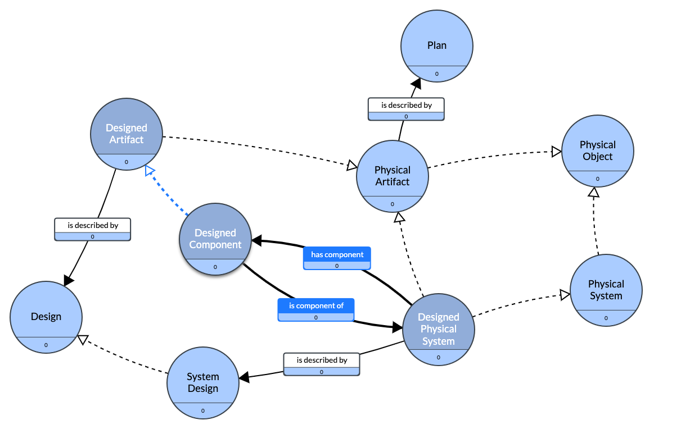

# Ontology Design Notes for AMMO

## Ontology Modules

### Identifier

### System -- TODO: Digital Twin

[Gra.fo editior link](https://app.gra.fo/editor/6a523737-eebd-45a4-9759-a262b295400c/public?token=b54149d4001ecfc073bc4c5d9ea3ab0b6f7142f21eb054d278fa1a9204feb9a0)


Most of the AMMO System Module has been extracted from Object Hierarcy in the [DOLCE+DnS Ultralite](http://ontologydesignpatterns.org/wiki/Ontology%3ADOLCE%2BDnS_Ultralite) [Systems Lite](http://www.ontologydesignpatterns.org/ont/dul/SystemsLite.owl) pattern.

### Process and Material Transformation

The Semantic Science Integrated Ontology

### Design Data Catalog

### Quantity Kinds for Specifications and Observations in QUDT

## Existing Additive Manufacturing Ontologies

### [Common Core Ontology](https://github.com/CommonCoreOntology/CommonCoreOntologies)

### [Nanomine](https://github.com/tetherless-world/nanomine-ontology)

The Nanomine [Ontology](https://raw.githubusercontent.com/tetherless-world/nanomine-ontology/master/nanomine.ttl) contains a materials [material processing module](https://raw.githubusercontent.com/tetherless-world/nanomine-ontology/master/materials_processing.ttl)build from SIO as a standardized upper ontology. Nanomine has been adopeted as part of NISTs [Material Resource Registry](https://materials.registry.nist.gov/). See: [A Controlled Vocabulary and Metadata Schema for Materials Science Data Discovery](https://tsapps.nist.gov/publication/get_pdf.cfm?pub_id%3D929119)

- [NanoMine schema: An extensible data representation for polymer nanocomposites](https://aip.scitation.org/doi/abs/10.1063/1.5046839)
- [Polymer Nanocomposite Data: Curation, Frameworks, Access, and Potential for Discovery and Design](https://pubs.acs.org/doi/10.1021/acsmacrolett.0c00264)

## Standard Ontologies

- Quantites, Units, Dimensions and Times Vocabulary([QUDT](http://www.qudt.org/)) and [Github Repository](https://github.com/qudt/qudt-public-repo)
- W3C Time Ontology in OWL ([OWL-Time](https://www.w3.org/TR/owl-time/)) and [Github Repository](https://github.com/w3c/sdw/tree/gh-pages/time)
- Open Geospatial Consortium [Geosparql](https://opengeospatial.github.io/ogc-geosparql/geosparql11/index.html) [Version 1.1 Github Repository](https://github.com/opengeospatial/ogc-geosparql/tree/master/1.1)
- [Data Catalog Vocabulary Version 3](https://www.w3.org/TR/vocab-dcat-3/) and [Github Repo](https://github.com/w3c/dxwg)
- W3C Prov-O: The PROV Ontology [Prov-O](https://www.w3.org/TR/prov-o/)
- If needed for observations and sensors: W3C Semantic Sensor Network Sensor, Observation, Sample, and Actuator ([SOSA](https://www.w3.org/TR/vocab-ssn/))

## Spatial Data

## Alignments

- Schema.org - [Product](https://schema.org/Product)
- [Wikidata](https://www.wikidata.org/wiki/Wikidata:Main_Page)
  - [3D Printing](https://www.wikidata.org/wiki/Q229367)
  - [3D Printing Process](https://www.wikidata.org/wiki/Q30592743) -- [Wikipedia](https://en.wikipedia.org/wiki/3D_printing_processes#Processes)
    Technologies:
    - [Selective Laser Melting](https://www.wikidata.org/wiki/Q2267983)
    - [Selective Heat Sintering](https://www.wikidata.org/wiki/Q16964377)
    - [Selective Laser Sintering](https://www.wikidata.org/wiki/Q428412)
    - [Fused Filament Fabrication](https://www.wikidata.org/wiki/Q428412)
  - [Additive Manufacturing](https://www.wikidata.org/wiki/Q360931)
  - [Manufacturing Process](https://www.wikidata.org/wiki/Q1408288)
  - [Engineering Process](https://www.wikidata.org/wiki/Q10843872)
  - [Property:Fabrication Method](https://www.wikidata.org/wiki/Property:P2079) -- Subproperty of [uses](https://www.wikidata.org/wiki/Property:P2283)
  - [Workpiece](https://www.wikidata.org/wiki/Q2560552)
  - [has quality](https://www.wikidata.org/wiki/Property:P1552)
    - [dimensional conformance](https://www.wikidata.org/wiki/Q1914776)
    - [product defect](https://www.wikidata.org/wiki/Q1138598)
    - [engineering tolerance](https://www.wikidata.org/wiki/Q950292)
  - [Design](https://www.wikidata.org/wiki/Q82604)

## Related Ontologies

[Digital Construction Ontology](https://digitalconstruction.github.io/v/0.3/index.html)

## Issues

Alignment of SIO quality to QUDT and Quantitiy Kind
An example alignment was done for water quality analysis
[Defining a water quality vocabulary using QUDT
and ChEBI](https://www.mssanz.org.au/modsim2013/L6/simons.pdf)
Simon Cox suggested an alignment between SOSA and BFO/SIO Quality.

```turtle
@prefix sio:
@prefix sosa:

ssn:Property owl:equivalentClass sio:000005 #SIO quality
sosa:ObservableProperty rdfs:subClassOf sio:000005 #SIO quality
```

RDA I-Adopt has released a set of [guidelines](https://doi.org/10.15497/RDA00071) and [Ontology](https://i-adopt.github.io/index.html) to help clarify the relationship between and Observable Property and a variable of interest. [Alignments to SOSA are also available](https://github.com/i-adopt).

Additionally, [SOSA-SHACL: Shapes Constraint for the Sensor, Observation, Sample, and Actuator Ontology](https://dl.acm.org/doi/fullHtml/10.1145/3502223.3502235) paper has a section on SHACL constraints for the results documents. It is contained in a github repository [KWG-SHACL](https://github.com/KnowWhereGraph/KWG-SHACL) and [example test graphs](https://github.com/KnowWhereGraph/KWG-SHACL/tree/main/test/example-graphs).

[Spatial Data on the Web Issue](https://github.com/w3c/sdw/issues/1267) "modeling units on properties instead of results"
